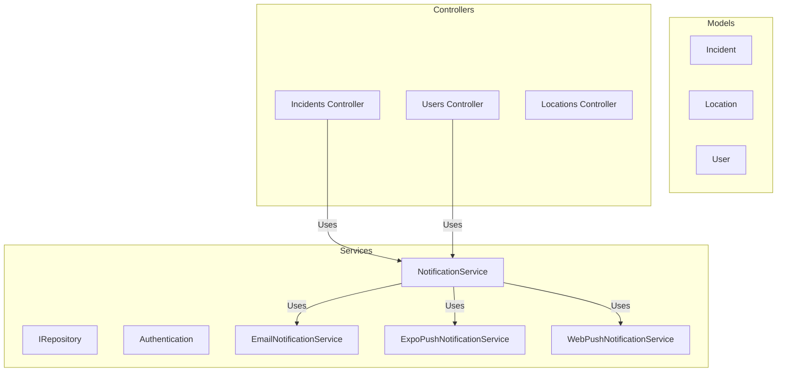
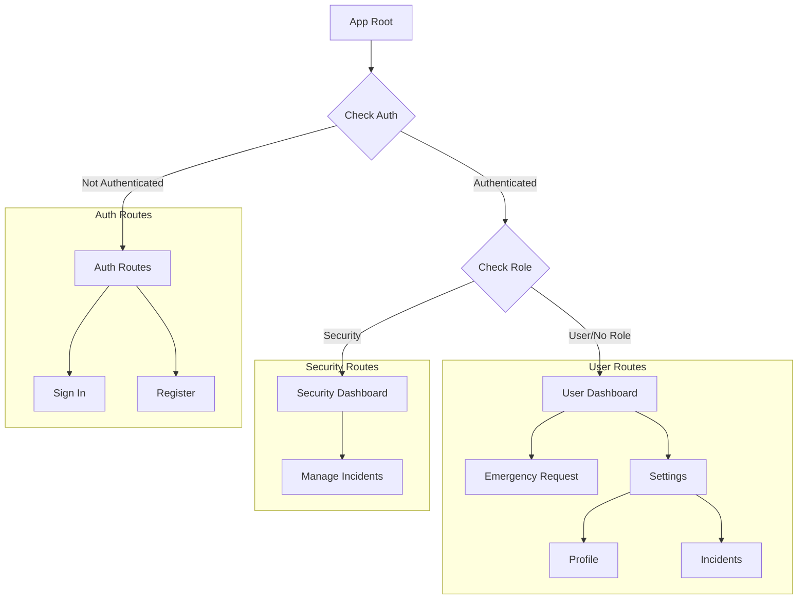
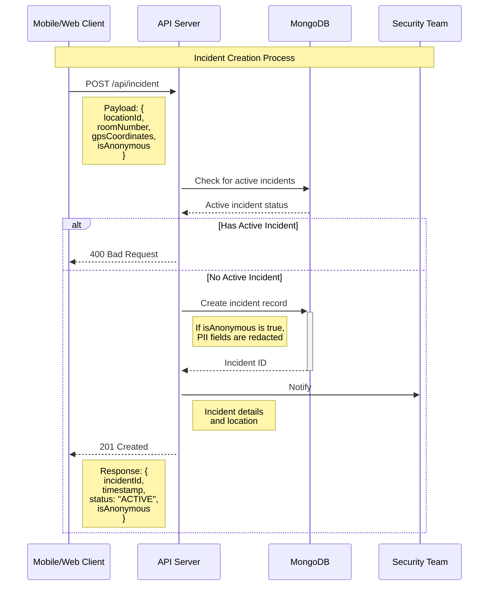
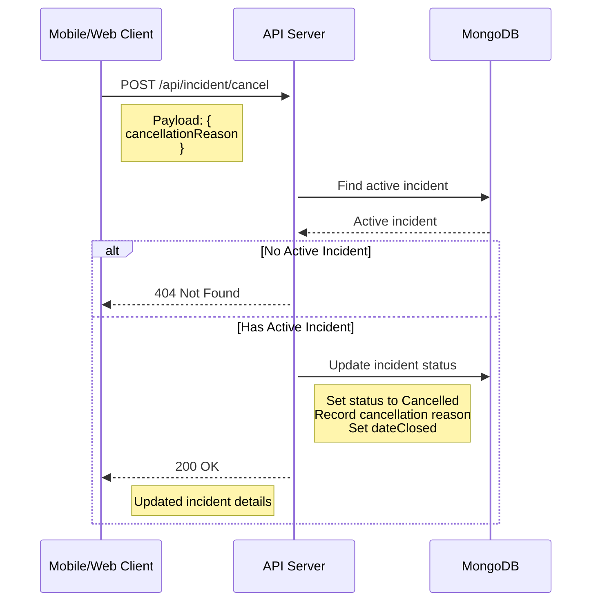
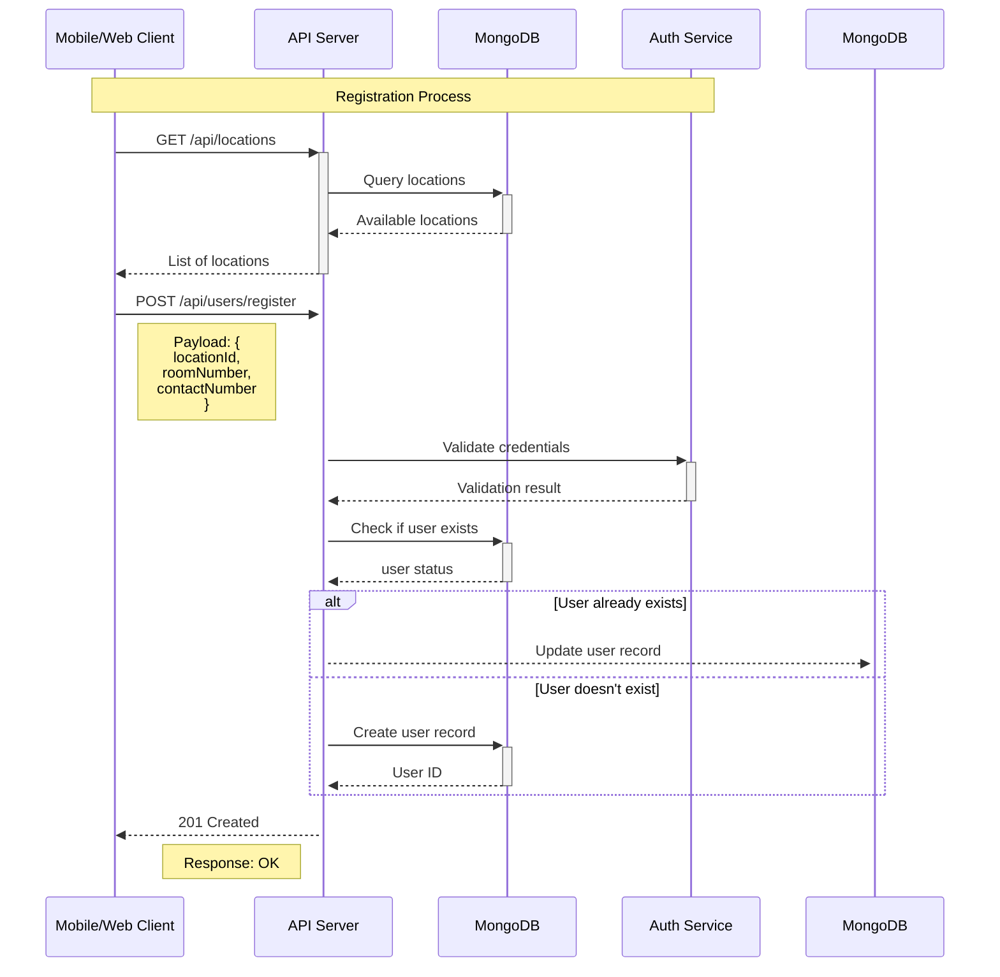
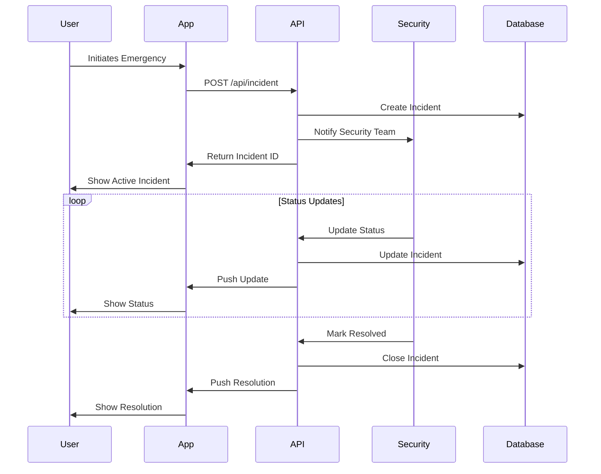
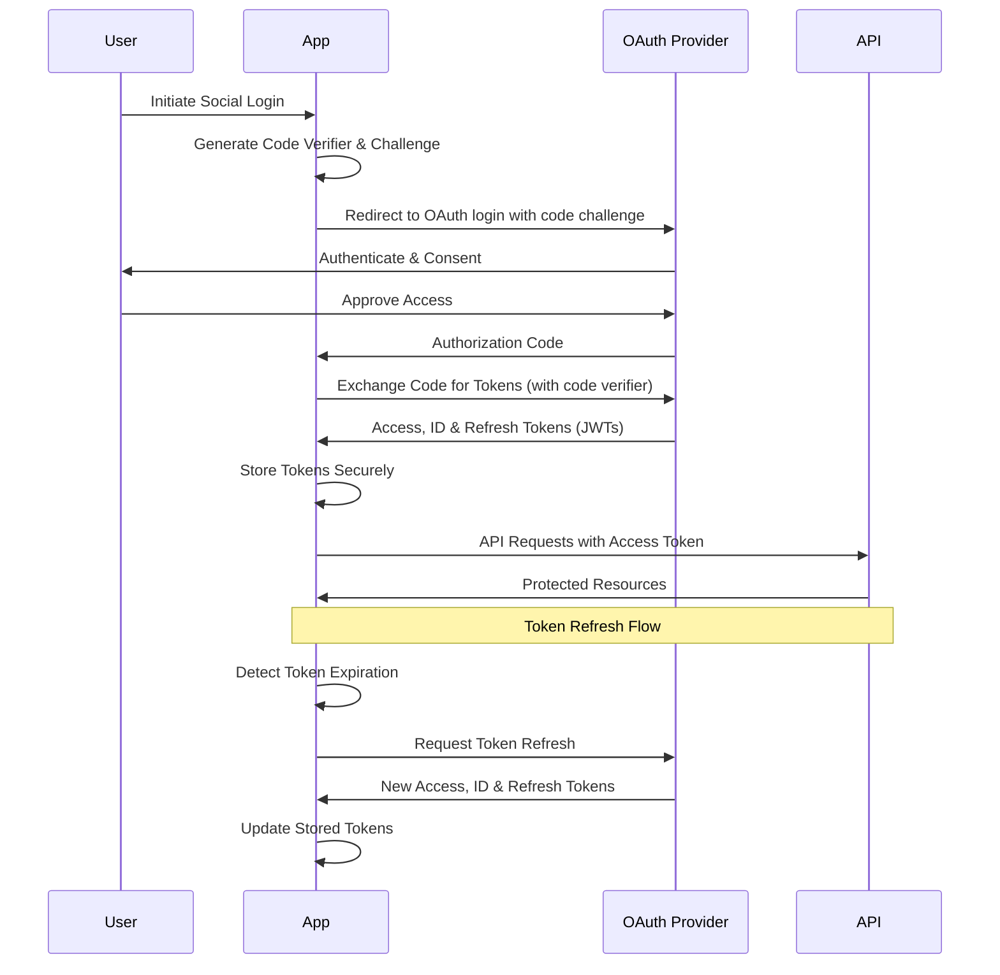
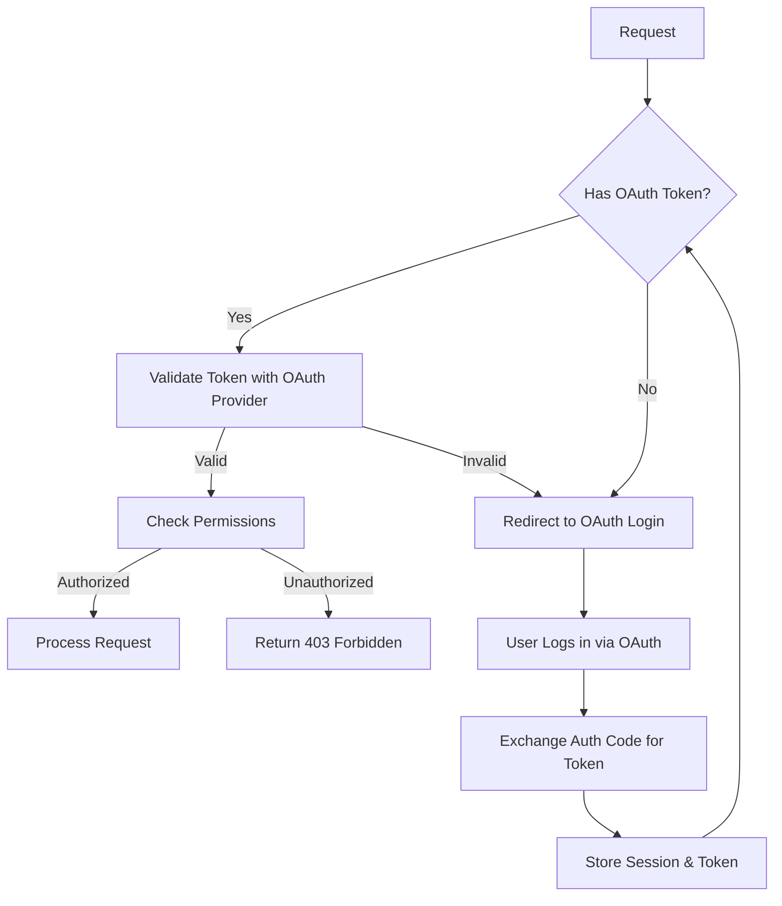
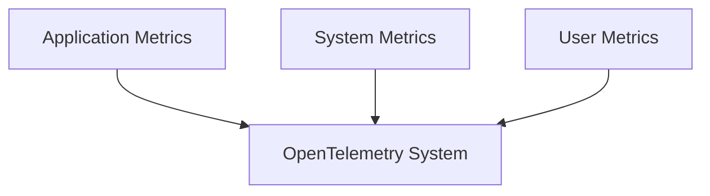

# Application Architecture

## Introduction

The Emergency Duress Application is a cross-platform mobile and web application built using modern technologies and following a client-server architecture, with an offline-first approach. The application is designed to handle emergency situations efficiently and reliably with or without an internet connection.

## Technical Stack

The application uses a modern technology stack chosen for reliability, scalability, and cross-platform capabilities:

| Layer    | Technology          | Purpose                                   |
| -------- | ------------------- | ----------------------------------------- |
| Frontend | React Native / Expo | Cross-platform mobile and web development |
|          | TypeScript          | Type-safe development                     |
|          | TailwindCSS         | Consistent styling across platforms       |
|          | Tanstack Query      | Powerful asynchronous state management    |
|          | Jest                | Component and integration testing         |
| Backend  | .NET 8              | Robust API development                    |
|          | MongoDB 3.1         | Document database for flexible storage    |
|          | Docker              | Containerization and deployment           |

### Frontend Architecture (apps/expo)

[Previous frontend architecture section remains unchanged...]

### Backend Architecture (apps/api)

The backend follows a layered architecture pattern using .NET 8:

#### ASP.NET Architecture



#### API Endpoints

| Endpoint         | Method | Purpose                     | Authentication |
| ---------------- | ------ | --------------------------- | -------------- |
| `/api/locations` | GET    | Returns a list of locations | Required       |

3i **/security**: Security responder routes

- Security dashboard for managing incidents
- Only accessible to users with 'security' role

When deployed to iOS and Android it will be a native application, and use platform native componentsg **IT IS NOT A WEBVIEW**

#### Routing Architecture

The application uses Expo Router for file-based routing, with a role-based access control structure:



The routing structure is organized into three main sections:

1. **(auth)**: Public authentication routes

   - /sign-in: OAuth-based authentication
   - /register: User registration (location assignment)

2. **/user**: End user (resident) routes

   - Main dashboard with emergency request functionality
     ---- - Settings section for profile and incident management
   - Only accessib le to users with 'user' role or no specific role

3. **/security**: Security responder routes
   - Security dashboard for managing incidents
   - Only accessible to users with 'security' role

When deployed to iOS and Android it will be a native application, and use platform native components. **IT IS NOT A WEBVIEW**

#### Component Architecture

| Component Type    | Purpose         | Implementation Details                  |
| ----------------- | --------------- | --------------------------------------- |
| Form Controls     | User Input      | Input, Select, Checkbox with validation |
| Platform Specific | Native Features | Platform-optimized components           |

### Backend Architecture (apps/api)

The backend follows a layered architecture pattern using .NET 8:

#### ASP.NET Architecture


#### API Endpoints

| Endpoint                   | Method | Purpose                     | Authentication |
| -------------------------- | ------ | --------------------------- | -------------- |
| `/api/locations`           | GET    | Returns a list of locations | Required       |
| `/api/incidents`           | POST   | Create emergency incident   | Required       |
| `/api/incidents/active`    | GET    | Get user's active incident  | Required       |
| `/api/incidents/cancel`    | POST   | Cancel active incident      | Required       |
| `/api/users`               | GET    | List users                  | Admin Only     |
| `/api/users/me`            | GET    | Get your user details       | Required       |
| `/api/users/me`            | PUT    | Update your profile         | Required       |
| `/api/users/me/push-token` | PUT    | Update push token           | Required       |

**Note:** Users can only have one active incident at a time. Attempting to create a new incident while one is active will result in a BadRequest response.

## Offline-first approach

The application is designed with an offline-first approach, ensuring that critical functionality remains available even when network connectivity is limited or unavailable. This approach is essential for emergency applications that must function reliably in all conditions.

### Key Components

- **TanStack Query**: Core data fetching and state management library
- **AsyncStorage Persister**: Persistence layer for caching query results
- **Network State Management**: Detection and handling of connectivity changes
- **Optimistic Updates**: UI updates before server confirmation
- **Background Synchronization**: Automatic retry of failed requests when connectivity is restored

### Implementation Highlights

- Query results are persisted to device storage for offline access
- Network connectivity is actively monitored to adjust application behavior
- Failed API requests are automatically retried when connectivity is restored
- The UI provides clear indicators of offline status and available functionality

For detailed information on the offline-first implementation, see the [Offline-First Implementation](./offline-first.md) documentation.

## Anonymous Incident Reporting

The application supports anonymous incident reporting, allowing users to opt-in to raise incidents anonymously on a case-by-case basis. When an incident is marked as anonymous:

- Personal identifiable information (PII) is redacted from the workflow and reporting
- The user's name, contact number, and room number are hidden
- The incident is still linked to the user internally for tracking purposes
- GPS coordinates are still included to ensure responders can locate the emergency

This feature balances user privacy with the need for effective emergency response. Users can toggle anonymity via a switch on the mobile app's welcome screen before making a distress call.

## Flows

Below are some flow diagrams of the application.

### Incident Creation Flow



### Incident Cancellation Flow



### User Registration Flow



### Emergency Response Flow



### Authentication Flow

The application uses OAuth 2.0 with OpenID Connect (OIDC) for authentication, implementing the Authorization Code Flow with PKCE (Proof Key for Code Exchange) for enhanced security.



#### Authentication Components

The frontend implements authentication through several key components:

1. **AuthProvider**: React context provider that manages authentication state

   - Handles token storage, refresh, and authentication flows
   - Provides authentication status and user information to the application

2. **useAuth Hook**: Custom React hook for accessing authentication functionality

   - Provides methods for sign-in, sign-out, and checking authentication status
   - Exposes user information and session details

3. **Token Management**:
   - Secure token storage using platform-specific mechanisms
   - Automatic token refresh when expired
   - Token validation and parsing

#### Role-Based Access Control

The application implements role-based access control using custom claims in the ID token:

```json
{
  "Authentication": {
    "Authority": "", // Auth0 authority URL
    "Audience": "", // API audience identifier
    "RoleClaimType": "emergency_app/roles"
  }
}
```

The authentication configuration is managed through appsettings.json and should be properly secured using environment variables in production.

- Roles are included in the ID token as a custom claim: `emergency_app/roles` (configured via Authentication:RoleClaimType setting)
- The frontend checks roles for conditional rendering of UI elements
- The backend verifies roles for protecting API endpoints

```typescript
// Example role check in frontend
const { user } = useAuth();
const isAdmin = user?.roles.includes("admin");

// Conditional rendering based on role
{
  isAdmin && <AdminPanel />;
}
```

```csharp
// Example role check in backend
[Authorize(Roles = "admin")]
[HttpGet]
public async Task<IActionResult> GetAdminData()
{
    // Only accessible to users with admin role
}
```

## Security Architecture

### Authentication & Authorization



## Monitoring and Observability

### OpenTelemetry Collection


