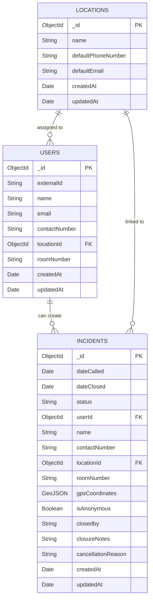
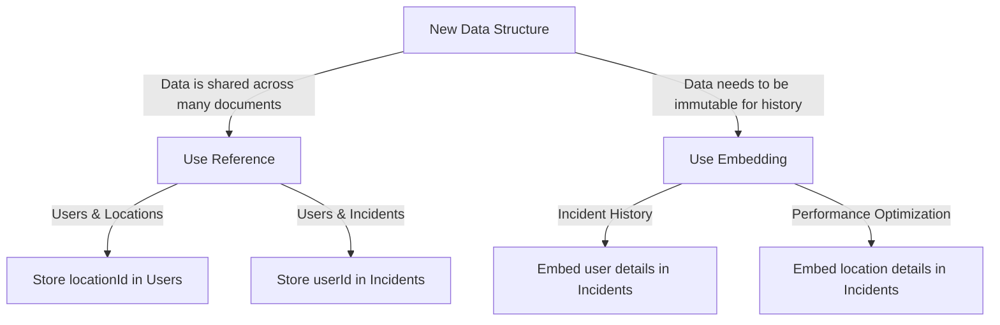
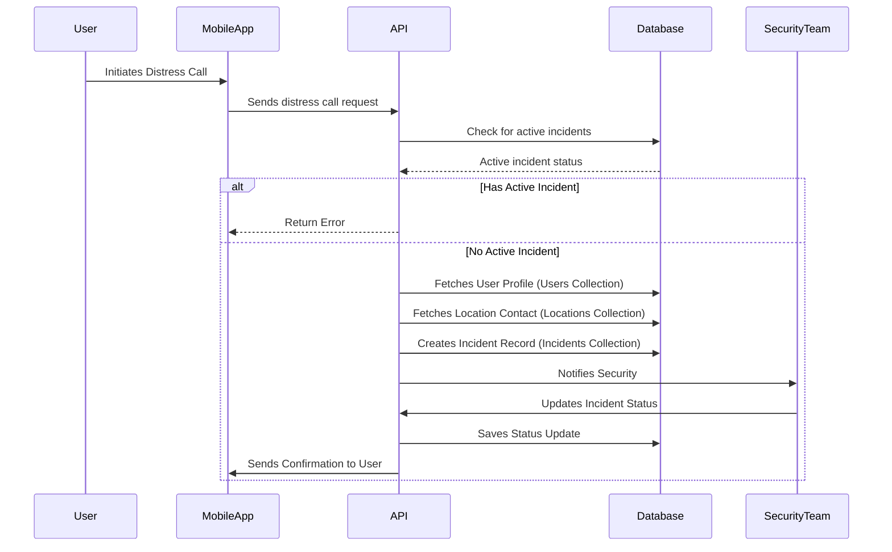

# Database Design

## Introduction

The chosen database for the project is MongoDB which is document database (document DB). Documents in MongoDB are referred to as a `record`, and are stored in a `collection` which is analogous to a table in relational databases.

> A record in MongoDB is a document, which is a data structure composed of field and value pairs. MongoDB documents are similar to JSON objects. The values of fields may include other documents, arrays, and arrays of documents.
>
> -- [MongoDB documentation](https://www.mongodb.com/docs/manual/introduction/#document-database)

Based on the requirements, the following collections have been designed:

- **Users** – Contains both authentication and profile details for end users.
- **Locations** – Contains location-specific configuration as set up by administrators (e.g. default phone numbers and emails).
- **Incidents/Distress Calls** – Contains records of emergency calls, digital incident data, and associated metadata.

## Database Schema

Below are the schemas representing the structure of each collection in the database.

### Users Collection

This collection stores authentication details (possibly with references to external ID providers) along with profile information.

| Field Name      | Type       | Description                              | Constraints                   |
| --------------- | ---------- | ---------------------------------------- | ----------------------------- |
| `_id`           | `ObjectId` | Unique identifier for the user           | Primary Key                   |
| `externalId`    | `String`   | ID from an external identity provider    | Unique                        |
| `name`          | `String`   | User's name (fetched from ID provider)   | Required                      |
| `email`         | `String`   | User's email address                     | Required, Unique              |
| `contactNumber` | `String`   | User's phone number in Australian format | Nullable                      |
| `locationId`    | `ObjectId` | Reference to a **Locations** document    | Foreign Key (`Locations._id`) |
| `roomNumber`    | `String`   | Room number assigned to the user         | Nullable                      |
| `createdAt`     | `Date`     | Document creation timestamp              | Required                      |
| `updatedAt`     | `Date`     | Document last update timestamp           | Required                      |

#### User Document JSON Example

```json
{
  "_id": ObjectId("..."),
  "externalId": "provider-12345",
  "name": "Alice Example",
  "email": "alice@example.com",
  "contactNumber": "+61123456789",
  "locationId": ObjectId("..."),
  "roomNumber": "101A",
  "createdAt": ISODate("2025-01-15T09:00:00Z"),
  "updatedAt": ISODate("2025-01-15T10:00:00Z")
}
```

---

### Locations Collection

This collection stores the list of locations as configured by the administrator. Each location has unique default contact information used for distress calls.

| Field Name           | Type       | Description                            | Constraints      |
| -------------------- | ---------- | -------------------------------------- | ---------------- |
| `_id`                | `ObjectId` | Unique identifier for the location     | Primary Key      |
| `name`               | `String`   | Location name                          | Required, Unique |
| `defaultPhoneNumber` | `String`   | Default contact number for emergencies | Required         |
| `defaultEmail`       | `String`   | Default email for emergency contacts   | Required         |
| `createdAt`          | `Date`     | Document creation timestamp            | Required         |
| `updatedAt`          | `Date`     | Document last update timestamp         | Required         |

#### Location Document JSON Example

```json
{
  "_id": ObjectId("..."),
  "name": "Camp Alpha",
  "defaultPhoneNumber": "+61111222333",
  "defaultEmail": "alpha@company.com",
  "createdAt": ISODate("2025-01-01T08:00:00Z"),
  "updatedAt": ISODate("2025-01-01T08:00:00Z")
}
```

---

### Incidents Collection

This collection stores records for distress calls (both telephony-initiated and digital incidents). You can store all required fields (timestamps, user details, location, GPS coordinates, status, etc.) and update the status as the incident is resolved or canceled.

**Business Rule:** Users can only have one active (Open status) incident at a time. This is enforced at the application level.

| Field Name           | Type             | Description                                     | Constraints                                             |
| -------------------- | ---------------- | ----------------------------------------------- | ------------------------------------------------------- |
| `_id`                | `ObjectId`       | Unique identifier for the incident              | Primary Key                                             |
| `dateCalled`         | `Date`           | Timestamp when the distress call was initiated  | Required                                                |
| `dateClosed`         | `Date`           | Timestamp when the incident was closed          | Nullable                                                |
| `status`             | `String`         | Incident status (`Open`, `Closed`, `Cancelled`) | Required                                                |
| `userId`             | `ObjectId`       | Reference to the **Users** document             | Foreign Key (`Users._id`), Unique when status is "Open" |
| `name`               | `String`         | Name of the caller                              | Nullable (for anonymous reports)                        |
| `contactNumber`      | `String`         | Caller's phone number                           | Nullable                                                |
| `locationId`         | `ObjectId`       | Reference to the **Locations** document         | Foreign Key (`Locations._id`)                           |
| `roomNumber`         | `String`         | Room number of the caller                       | Nullable                                                |
| `gpsCoordinates`     | `GeoJSON Object` | Location coordinates (`Point`)                  | Nullable                                                |
| `isAnonymous`        | `Boolean`        | Flag indicating if the incident is anonymous    | Required, Default: false                                |
| `closedBy`           | `String`         | Name of Security Responder that closed it       | Nullable                                                |
| `closureNotes`       | `String`         | Notes on resolution                             | Nullable                                                |
| `cancellationReason` | `String`         | Reason for cancellation (if applicable)         | Required when status is "Cancelled"                     |
| `createdAt`          | `Date`           | Document creation timestamp                     | Required                                                |
| `updatedAt`          | `Date`           | Document last update timestamp                  | Required                                                |

#### Incident Document JSON Example

```json
{
  "_id": ObjectId("..."),
  "dateCalled": ISODate("2025-02-05T14:30:00Z"),
  "dateClosed": null,
  "status": "Open",
  "userId": ObjectId("..."),
  "name": "Alice Example",
  "contactNumber": "+61123456789",
  "locationId": ObjectId("..."),
  "roomNumber": "101A",
  "gpsCoordinates": { "type": "Point", "coordinates": [151.2093, -33.8688] },
  "isAnonymous": false,
  "closedBy": null,
  "closureNotes": null,
  "cancellationReason": null,
  "createdAt": ISODate("2025-02-05T14:30:00Z"),
  "updatedAt": ISODate("2025-02-05T14:30:00Z")
}
```

---

### ERD



### Validation

- **JSON Schema Validation:** Leveraging MongoDB's schema validation to enforce field types and required properties. For example, every incident document must include a valid `status`, and a reference `locationId`.
- **Field Constraints:** For fields like phone numbers or email addresses, the code leverages validation rules to ensure they match the expected formats.
- **Business Rules:** The application enforces that a user can only have one active (Open status) incident at a time. This is validated before creating a new incident.
- **Status Validation:** The cancellationReason field is required when an incident's status is changed to "Cancelled".

## Reference and Embedding

Whilst the common approach is to embed data into documents when leveraging a document DB, it can sometimes be useful to instead reference a document. Below are example use cases for each.  
The recommended approach is to **use references when data is shared across multiple documents and embedding when historical accuracy or fast access is required.**

### Referencing

- **Users & Locations:** Storing a `locationId` in the user document (reference) is recommended because locations are shared among many users. This avoids redundant storage and ensures that updates to locations are reflected across all users without requiring multiple updates.

- **Users & Incidents:** The `userId` in an incident document references the user, allowing efficient queries on incidents related to a specific user and enforcing the one-active-incident-per-user rule. However, key details like `name` and `contactNumber` should still be embedded at the time of incident creation to preserve historical accuracy.

### Embedding

- **Incidents:** Storing user profile details redundantly (e.g., `name`, `contactNumber`) in each incident ensures that the record remains historical even if the user updates their profile later. This is an example of denormalization that suits MongoDB well and prevents loss of context in case of account deletion.

### General Guidelines

- **Reference when data is frequently updated and shared** across multiple documents to prevent redundancy.
- **Embed when data is immutable** or needs to remain unchanged for historical accuracy.
- **Consider query patterns:** If an entity is always fetched along with its related data, embedding may be beneficial for performance.

### Decision Tree



## Distress Call Flow

When a distress call is made by an authenticated user:

1. **Check active incidents** (validate user has no open incidents).
2. **User initiates distress call** (via app).
3. **System retrieves user details** (from **Users** collection).
4. **Location contact details are fetched** (from **Locations** collection).
5. **Incident document is created** (in **Incidents** collection).
6. **Security team updates the status** (as actions are taken).



## Implementation Considerations

- **Time Zones:**  
  Timestamps are stored as UTC time, and converted as needed at the application layer.

- **Security and Access Control:**  
  An implementor could leverage MongoDB's built-in security features (e.g., role-based access) to ensure that:

  - End users can only update their own profiles.
  - Security responders can view incidents for assigned locations.
  - Company managers can view all incidents (with filtering).

- **Performance and Scalability:**
  Denormalize data to reduce the need for joins. However, be mindful of document growth, and if the data is shared between multiple documents. Refer to [Reference and Embedding](#reference-and-embedding) for details on when and how you should dernormalise.
