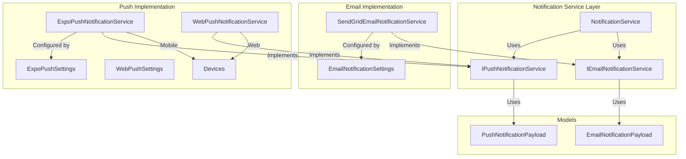
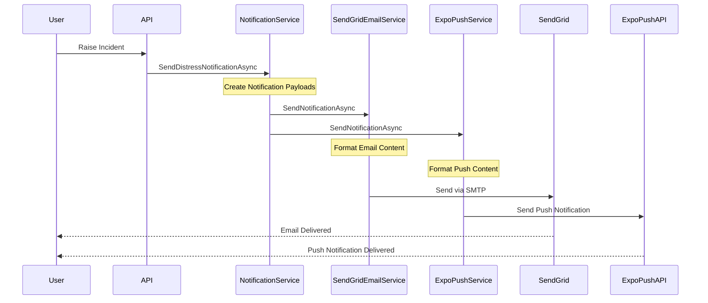

# Notification System Architecture

## Overview

The Emergency Duress Application implements a comprehensive notification system that ensures security responders are promptly informed of incidents through both email and mobile push notifications.

## Architecture Overview

The notification system follows SOLID principles and uses a pluggable architecture that allows for different notification providers:



## Components

### 1. NotificationService

The central orchestrator that:

- Routes notifications to appropriate channels (email and push)
- Determines email recipients based on location configuration
- Routes push notifications to security responders' registered devices
- Manages notification delivery and error handling

```csharp
public interface INotificationService
{
    Task SendDistressNotificationAsync(Incident incident, Location location);
}
```

### 2. IEmailNotificationService

Defines the contract for email delivery:

- Supports single and multiple recipient scenarios
- Handles anonymous incident reporting
- Provides a standard interface for different email providers

```csharp
public interface IEmailNotificationService
{
    Task SendNotificationAsync(string recipientEmail, EmailNotificationPayload payload);
    Task SendNotificationAsync(IEnumerable<string> recipientEmails, EmailNotificationPayload payload);
}
```

### 3. SendGridEmailNotificationService

The default implementation using SendGrid:

- Implements SMTP using SendGrid's API
- Formats email content according to specifications
- Handles both HTML and plain text formats
- Manages configurations through dependency injection

### 4. IPushNotificationService

Defines the contract for push notification delivery:

```csharp
public interface IPushNotificationService
{
    Task SendNotificationAsync(string deviceToken, PushNotificationPayload payload);
    Task SendNotificationAsync(IEnumerable<string> deviceTokens, PushNotificationPayload payload);
}
```

### 5. ExpoPushNotificationService

The default mobile implementation using Expo Push Service:

- Implements push notifications using Expo's API
- Supports both single and bulk device notifications
- Handles device token management
- Formats notifications with standard content:
  ```
  Title: Duress app alert
  Body: Location: <Location>
  Data: Link to record in Web app
  ```

### 6. WebPushNotificationService

Implementation using the Web Push API standard:

- Implements push notifications using the Web Push protocol.
- Supports VAPID authentication for secure push delivery.
- Handles client-side service worker registration, subscription validation, and token formatting.
- Implements exponential backoff to automatically retry failed push attempts.
- Formats notifications with standard content:
  ```
  Title: Duress app alert
  Body: Location: <Location>
  Data:
    - URL to incident
    - Incident ID
    - Location name
    - Additional context
  ```
- **API Integration:** Configure your API (e.g., in `appsettings.json`) with a dedicated `WebPush` section:
  ```json
  {
    "Notifications": {
      "WebPush": {
        "VapidPublicKey": "configured-via-environment",
        "VapidPrivateKey": "configured-via-environment",
        "VapidSubject": "configured-via-environment",
        "TimeoutSeconds": 30,
        "MaxRetryAttempts": 3
      }
    }
  }
  ```
  This configuration must match the frontend VAPID settings.

## Configuration

### Notification Settings

```json
{
  "Notifications": {
    "Email": {
      "DefaultSenderEmail": "sender@example.com",
      "DefaultSenderName": "Emergency Duress System",
      "WebAppBaseUrl": "https://app.example.com"
    },
    "SendGrid": {
      "ApiKey": "configured-via-environment"
    },
    "Expo": {
      "ApiUrl": "https://exp.host/--/api/v2/push/send",
      "TimeoutSeconds": 30,
      "UseProduction": false,
      "AccessToken": "configured-via-environment"
    },
    "WebPush": {
      "VapidPublicKey": "configured-via-environment",
      "VapidPrivateKey": "configured-via-environment",
      "VapidSubject": "configured-via-environment",
      "TimeoutSeconds": 30,
      "MaxRetryAttempts": 3
    }
  }
}
```

### Device Registration

Device token registration is handled through the `/api/users/me/push-token` endpoint:

```http
PUT /api/users/me/push-token
Authorization: Bearer {token}
Content-Type: application/json

{
  "token": "ExponentPushToken[xxxxxxxxxxxxxxxxxxxxxx]"
}

Response 200 OK:
{
  "message": "Push token updated successfully"
}
```

Each user can have multiple device tokens stored in their profile:

```json
"deviceTokens": [
  "ExponentPushToken[xxxxxxxxxxxxxxxxxxxxxx]"
]
```

Web Push subscriptions use the following format:

```
{endpoint}|{p256dh}|{auth}
```

Where:

- endpoint: The push service URL for the subscription
- p256dh: The P-256 ECDH public key
- auth: The authentication secret

These components are combined into a single string and stored in the user's deviceTokens array, allowing both web and mobile tokens to coexist.

### Location Configuration

Each location requires a default email address:

```json
{
  "name": "Building A",
  "defaultEmail": "security-a@example.com"
}
```

## Notification Content

### Email Format

- Subject: `Duress call: {Location}`
- Body includes:
  - Open In App link
  - Date called
  - Name (or "Anonymous")
  - Contact number (or "Anonymous")
  - Location and room number
  - GPS coordinates (if available)

### Push Notification Format

- Title: `Duress app alert`
- Body: `Location: {Location}`
- Data payload:
  - Incident ID
  - Web app URL
  - Room number (if provided)
  - Additional context

## Sequence Flow



## Testing

Comprehensive unit tests cover all notification components:

1. SendGridEmailNotificationServiceTests

   - Email delivery verification
   - Content formatting validation
   - Error handling scenarios

2. ExpoPushNotificationServiceTests

   - Single and bulk device notifications
   - Payload formatting
   - Error handling and retries

3. NotificationServiceTests
   - Multi-channel notification coordination
   - Recipient resolution
   - Device token management
   - Error handling across channels

## Security Considerations

1. API Keys and Tokens

   - Sensitive credentials stored in environment variables
   - Regular key rotation
   - Secure token management

2. Data Protection

   - PII redaction in anonymous incidents
   - Minimal sensitive data in push notifications
   - Secure transport (TLS/HTTPS)

3. Device Security
   - Device token validation
   - Authentication required for registration
   - Token cleanup on logout
   - Automatic token deduplication
   - Token format validation (Expo tokens only)
   - Token storage in user profile
   - Token persistence across sessions

## Alternative Providers

The system supports alternative implementations:

```csharp
public class AlternativeEmailService : IEmailNotificationService
{
    // Implementation
}

public class AlternativePushService : IPushNotificationService
{
    // Implementation
}
```

## Error Handling

- Graceful degradation across channels
- Comprehensive error logging
- Automatic retries for transient failures
- Admin notifications for systemic issues
