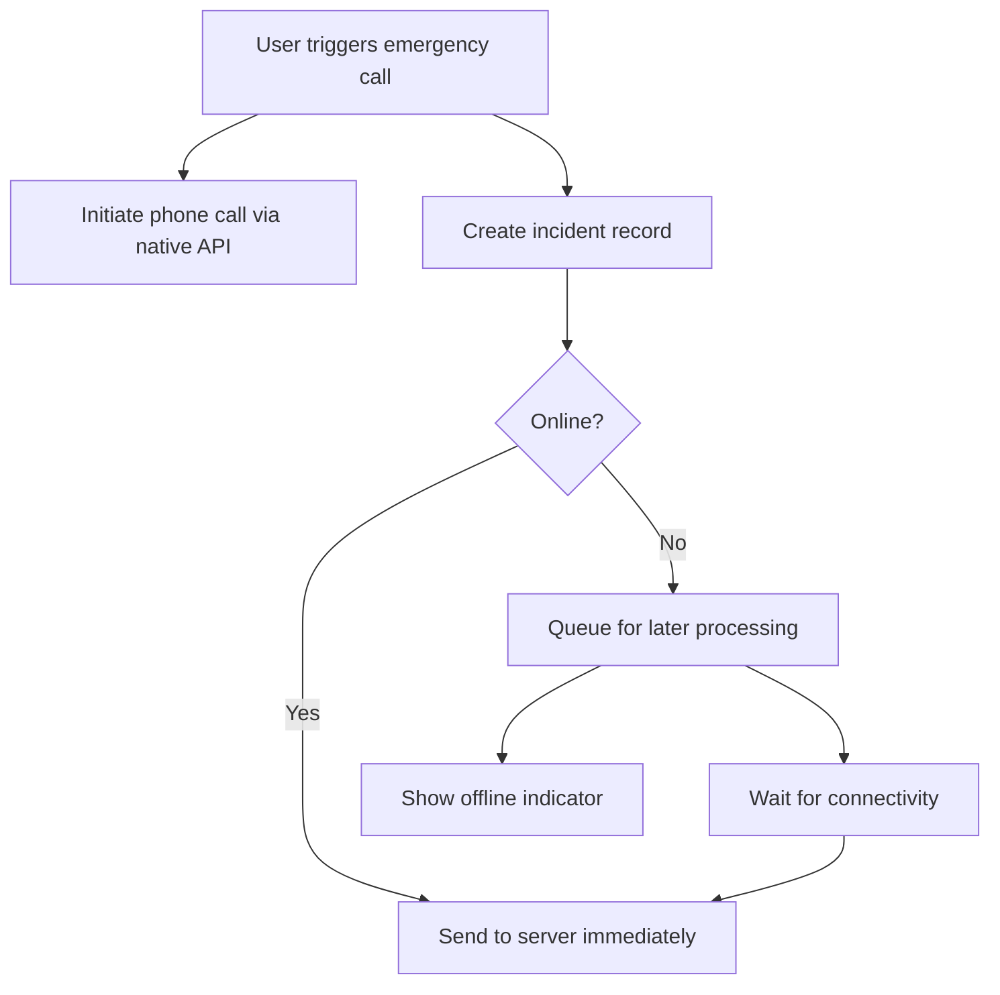

# Offline-First Implementation

## Overview

The Emergency Duress Application is designed with an offline-first approach, ensuring that critical functionality remains available even when network connectivity is limited or unavailable. This document details the implementation of the offline-first architecture, focusing on data persistence, synchronization strategies, and the user experience.

## Key Components

The offline-first implementation relies on several key technologies and patterns:

1. **TanStack Query** - Core data fetching and state management library
2. **AsyncStorage Persister** - Persistence layer for caching query results
3. **Network State Management** - Detection and handling of connectivity changes
4. **Optimistic Updates** - UI updates before server confirmation
5. **Background Synchronization** - Automatic retry of failed requests when connectivity is restored

## TanStack Query Implementation

[TanStack Query](https://tanstack.com/query) (formerly React Query) serves as the foundation of our offline-first approach, providing powerful data fetching, caching, and synchronization capabilities.

### Query Client Configuration

```typescript
const queryClient = new QueryClient({
  defaultOptions: {
    queries: {
      gcTime: Infinity, // Never garbage collect queries
      staleTime: 1000 * 60 * 5, // 5 minutes
    },
  },
});
```

Key configuration choices:

- **Infinite GC Time**: Prevents cached data from being garbage collected, ensuring it remains available offline
- **Stale Time**: Determines how long data is considered fresh before triggering a background refetch

### Query Persistence

Query results are persisted to device storage using the AsyncStorage persister:

```typescript
const persister = createAsyncStoragePersister({
  storage: AsyncStorage,
  key: Platform.OS === "web" ? "REACT_QUERY_WEB" : "REACT_QUERY_NATIVE",
});

persistQueryClient({
  queryClient,
  persister,
  maxAge: 1000 * 60 * 60 * 24 * 7, // 1 week
});
```

This configuration:

- Persists all query results to AsyncStorage
- Uses platform-specific storage keys for web and native
- Retains persisted data for up to one week

## Network State Management

The application actively monitors network connectivity to adjust its behavior based on the current connection status.

### Online State Detection

```typescript
onlineManager.setEventListener((setOnline) => {
  const eventSubscription = Network.addNetworkStateListener((state) => {
    setOnline(!!state.isConnected);
  });
  return eventSubscription.remove;
});
```

This implementation:

- Uses Expo's Network module to detect connectivity changes
- Updates TanStack Query's internal online state
- Automatically triggers refetching when connectivity is restored

## Data Synchronization Strategies

### Optimistic Updates

For critical operations like incident creation, the application uses optimistic updates to provide immediate feedback while ensuring data consistency:

1. Update the local UI immediately
2. Send the API request
3. If successful, confirm the update
4. If failed, revert to the previous state and queue for retry

Example implementation:

```typescript
const createIncidentMutation = useMutation({
  mutationFn: createIncident,
  onMutate: async (newIncident) => {
    // Cancel outgoing refetches
    await queryClient.cancelQueries({ queryKey: ["activeIncident"] });

    // Snapshot the previous value
    const previousIncident = queryClient.getQueryData(["activeIncident"]);

    // Optimistically update to the new value
    queryClient.setQueryData(["activeIncident"], {
      ...newIncident,
      id: "temp-id",
      status: "Open",
      dateCalled: new Date(),
    });

    return { previousIncident };
  },
  onError: (err, newIncident, context) => {
    // If the mutation fails, roll back the optimistic update
    queryClient.setQueryData(["activeIncident"], context.previousIncident);
  },
  onSettled: () => {
    // Always refetch after error or success
    queryClient.invalidateQueries({ queryKey: ["activeIncident"] });
  },
});
```

### Background Synchronization

Failed mutations (e.g., creating an incident while offline) are automatically retried when connectivity is restored:

1. Mutations are persisted in a queue
2. When online status changes to true, queued mutations are retried
3. Success or failure is handled appropriately

## Offline-First User Experience

### Loading States

The application implements sophisticated loading states to provide a seamless user experience:

1. **Initial Load**: Shows skeleton UI while data is being fetched
2. **Subsequent Loads**: Shows cached data immediately while refreshing in the background
3. **Offline Mode**: Clearly indicates offline status while showing available cached data

### Error Handling

Comprehensive error handling ensures users understand the current state:

1. **Network Errors**: Shown when a request fails due to connectivity issues
2. **Validation Errors**: Displayed when input validation fails (even offline)
3. **Server Errors**: Presented when the server returns an error response

### Offline Indicators

The UI includes clear indicators of offline status:

- Status bar indicator showing offline mode
- Contextual messages explaining limited functionality
- Visual differentiation of actions that require connectivity

## Telephony Integration

The telephony integration is a critical component that leverages the offline-first architecture:

1. **Immediate Call Execution**: Phone calls are initiated immediately using native APIs
2. **Background Incident Creation**: Incident records are created in the background
3. **Offline Queueing**: If offline, incident creation is queued for later processing



## Offline Hooks

The Emergency Duress Application leverages several custom hooks to manage offline capabilities. These hooks integrate with TanStack Query and AsyncStorage to persist query results, monitor connectivity, and handle incident synchronization. Notable hooks include:

- **useQueries**: Enhances React Query with offline support, automatically caching and rehydrating query results.
- **useIncidentActions**: Provides functions to manage incident creation, updates, cancellations, and synchronization, ensuring that offline incidents are queued and processed upon reconnection.
- **useIncidentStatus**: Tracks the status of incidents to display appropriate offline indicators and manage error states.

These hooks encapsulate much of the offline logic and are essential to maintaining a responsive and robust offline-first experience.

## Implementation Details

### Query Keys Structure

The application uses a consistent query key structure to organize and manage cached data:

- `['user']` - Current user profile
- `['locations']` - Available locations
- `['activeIncident']` - User's active incident
- `['incidents']` - List of incidents

### Mutation Persistence

Mutations are persisted using the same AsyncStorage mechanism:

```typescript
// Persist mutations that happen while offline
persistQueryClient({
  queryClient,
  persister,
  mutationStorage: {
    getItem: async (key) => {
      const data = await AsyncStorage.getItem(key);
      return data ? JSON.parse(data) : null;
    },
    setItem: async (key, value) => {
      await AsyncStorage.setItem(key, JSON.stringify(value));
    },
    removeItem: async (key) => {
      await AsyncStorage.removeItem(key);
    },
  },
});
```

### Dehydration and Rehydration

When the application starts, it rehydrates the query cache from persistent storage:

```typescript
// On app startup
const dehydratedState = await persister.getPersistedState();
if (dehydratedState) {
  hydrate(queryClient, dehydratedState);
}
```

## Testing Strategy

The offline-first implementation includes comprehensive testing:

1. **Unit Tests**:

   - Test individual components of the offline system
   - Verify correct behavior of optimistic updates
   - Ensure proper error handling

2. **Integration Tests**:

   - Test the complete offline-to-online flow
   - Verify data synchronization when connectivity is restored
   - Test edge cases like partial connectivity

3. **Simulation Testing**:
   - Use network condition simulation to test various scenarios
   - Test slow connections, intermittent connectivity, and complete offline mode

## Performance Considerations

### Storage Limits

The application implements storage management to prevent excessive cache growth:

1. **Selective Persistence**: Only critical queries are persisted
2. **TTL (Time-to-Live)**: Cached data expires after a defined period
3. **Size Monitoring**: Large responses are handled specially to avoid storage limits

### Battery Impact

Offline-first functionality is designed to minimize battery impact:

1. **Efficient Polling**: Background refetching uses adaptive intervals
2. **Network-Aware Syncing**: Synchronization attempts are paused on metered connections
3. **Batch Processing**: Multiple updates are batched when coming back online

## Security Considerations

### Offline Data Security

Cached data is secured through:

1. **Encrypted Storage**: AsyncStorage data is encrypted on device
2. **Minimal Sensitive Data**: Limiting what sensitive information is cached
3. **Token Security**: Authentication tokens are stored securely and refreshed appropriately

## Conclusion

The offline-first implementation ensures that the Emergency Duress Application remains functional and responsive regardless of network conditions. By leveraging TanStack Query, AsyncStorage persistence, custom offline hooks, and sophisticated synchronization strategies, the application provides a seamless user experience while maintaining data integrity and security.

## References

- [TanStack Query Documentation](https://tanstack.com/query/latest/docs/react/overview)
- [Offline-First Web and Mobile Apps](https://offlinefirst.org/)
- [AsyncStorage Documentation](https://react-native-async-storage.github.io/async-storage/docs/usage)
