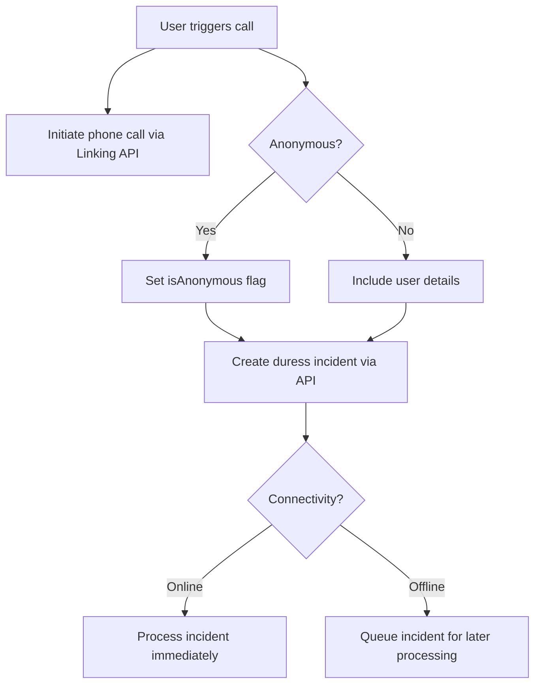

# Telephony Integration Architecture

## Architecture Overview

The telephony integration is designed as a resilient, offline-first feature that seamlessly coordinates native telephony operations with backend duress incident creation. This design ensures that emergency calls are initiated immediately while duress incidents are reliably recorded, even in fluctuating network conditions.

## Key Components

- **Native Telephony Interface:** Utilizes React Native’s `Linking` API to initiate phone calls immediately.
- **Offline Persistence:** Leverages TanStack Query with `@tanstack/query-async-storage-persister` to cache and persist API call data for up to one week. This supports offline operation and automatic retries.
- **Duress Incident API:** Handles the creation of duress incidents. If online, the call is made immediately; if offline, the request is queued until connectivity is restored.

## Data Flow

## Design Considerations

- **Resilience:** Emphasis on offline-first behavior and robust error handling.
- **Simplicity:** Clear separation of telephony and API interactions for ease of maintenance.
- **Scalability:** Modular architecture allowing for future integration of additional emergency response features.
- **Privacy:** Support for anonymous incident reporting, allowing users to opt-in to anonymity on a case-by-case basis while still initiating emergency calls.

### Anonymous Incident Handling

When a user opts for anonymous incident reporting:

1. The telephony call is initiated normally using the location's default phone number
2. The duress incident is created with the `isAnonymous` flag set to true
3. Personal identifiable information (PII) is redacted from the incident record
4. GPS coordinates are still included to ensure responders can locate the emergency
5. The incident is still tracked internally for system integrity and accountability

## Testing Strategy

Testing focuses on:

- Ensuring immediate telephony call execution.
- Validating offline persistence and subsequent retry of API calls.
- Confirming clear separation of concerns across system components.
- Verifying proper handling of anonymous incident reporting:
  - Confirming PII redaction when anonymity is requested
  - Ensuring GPS coordinates are still included for anonymous incidents
  - Testing the UI toggle for anonymity and its effect on the incident creation process
