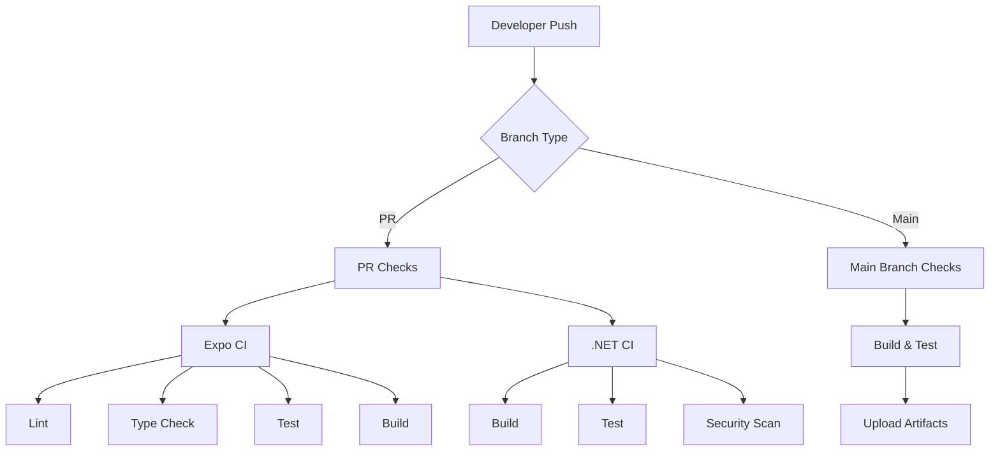

# CI/CD Documentation

## Overview

This documentation outlines the Continuous Integration and Continuous Delivery (CI/CD) setup for the Emergency Duress App. The project uses GitHub Actions for automation, implementing separate pipelines for the Expo frontend and .NET backend to ensure code quality, run tests, and maintain security.

## Quick Links

- [Workflow Documentation](./workflows.md) - Detailed information about CI/CD pipelines
- [Pull Request Guide](./pull-requests.md) - PR process and requirements
- [Dependency Management](./dependency-mgmt.md) - How we handle dependencies
- [Security Practices](./security.md) - Security scanning and best practices

## CI/CD Architecture

## Key Features

- **Separate Workflows**: Independent pipelines for frontend and backend
- **Automated Testing**: Comprehensive test suites with coverage reporting
- **Security Scanning**: CodeQL analysis for vulnerability detection
- **Dependency Updates**: Automated with Dependabot
- **Quality Gates**: Enforced code quality standards

## Pipeline Status

### Frontend (Expo)

- Runs on: Pull Requests, Push to main
- Test Coverage Requirement: 80%
- Key Checks:
  - ESLint
  - TypeScript
  - Jest Tests
  - Build Verification

### Backend (.NET)

- Runs on: Pull Requests, Push to main
- Key Checks:
  - Build Validation
  - Unit Tests
  - Code Coverage
  - Security Scanning

## Getting Started

1. Review the [workflows documentation](./workflows.md) to understand our CI/CD pipelines
2. Check the [pull request guide](./pull-requests.md) before creating PRs
3. Configure your development environment according to the README
4. Monitor build status in GitHub Actions
