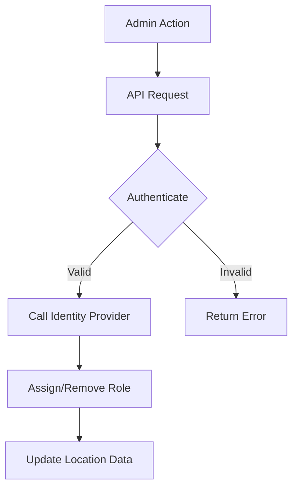
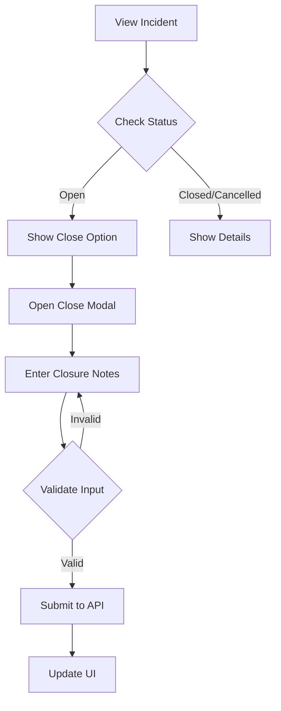

# Security Responder Management

This document outlines the security responder management feature for the emergency duress application, detailing its functionality, technical implementation, and security considerations.

## Overview

The security responder management feature enables company administrators to assign and manage security responders for specific locations. This process ensures that there is clear ownership of incident response across all locations, supports effective digital workflow management, audit reporting, and precise identity tracking. Only authenticated company administrators can perform these actions, and role management is securely delegated to the identity provider.

## Features

### View Security Responders

- Company administrators can view a dedicated list of security responders assigned to each location.
- Provides clear visibility into responder assignments and their current status.

### Add Security Responders

- Administrators can add security responders to a location by specifying their email address.
- Upon addition, the responder is automatically assigned the "Security Responder" role via the identity provider.
- Email validation is enforced to ensure only valid and registered email addresses are accepted.

### Remove Security Responders

- Administrators can remove a security responder from a given location.
- If a responder is no longer assigned to any locations, the identity provider will revoke their "Security Responder" role automatically.
- Clear feedback is provided through the user interface for all operations.

### Incident Management

- Security responders can view and manage incidents assigned to their location.
- Detailed incident view shows all relevant information including:
  - Date/Time of incident
  - Status (Open/Closed/Cancelled)
  - Location details
  - Requestor information (if not anonymous)
  - GPS coordinates (if available)
  - Duration of incident (for closed incidents)
- Responders can close incidents with:
  - Required closure notes
  - Automatic tracking of who closed the incident
  - Timestamp of closure
- Modal-based interface for incident closure ensures clear user flow and validation

## Technical Implementation

### API Endpoints

All endpoints require authentication with company administrator privileges.

```http
GET /api/locations/{id}
# Returns location details including the list of assigned security responders

POST /api/locations/{id}/security-responders
# Adds a security responder to a location
{
    "email": "responder@example.com"
}

DELETE /api/locations/{id}/security-responders/{email}
# Removes a security responder from a location

POST /api/incident/{id}/close
# Closes an incident with notes
{
    "closureNotes": "string",
    "closedBy": "string"
}
```

### Role Management

- Role assignments for Security Responders are delegated to the identity provider.
- The API maintains the association between security responders and locations.
- Role updates, including assignment and removal, occur automatically through secure identity provider mechanisms.

### User Interface Integration

- The security responder management interface is integrated within the admin location management screens.
- It features both a list view (overseeing all locations) and a detail view (for managing responders on a specific location).
- The interface includes search functionality to locate responders by email quickly.
- Clear success and error notifications are provided for all responder management operations.
- Incident management uses a modal-based approach for key actions like closing incidents.

## Security Considerations

- Only company administrators are permitted to manage security responders.
- Only assigned security responders can view and manage incidents for their location.
- Email addresses are validated on both the client and server sides before being processed.
- Role management operations are executed with strict security controls via the identity provider.
- All incident management actions are logged with user attribution.

## Error Handling

The feature includes comprehensive error handling for scenarios such as:

- Invalid or unregistered email addresses
- Duplicate responder assignments
- Network or server-side failures
- Permission and authentication issues
- Invalid incident closure attempts

## Future Enhancements

Potential future improvements for this feature include:

- Bulk import/export functionality for managing multiple responders at once
- Advanced filtering and search capabilities within the management interface
- Automated notifications to alert administrators when responders are added or removed
- Analytics and reporting on responder assignments and incident response effectiveness
- Real-time incident status updates and communication
- Mobile push notifications for new incidents

## Diagrams

### Workflow Diagram



### Incident Management Flow


