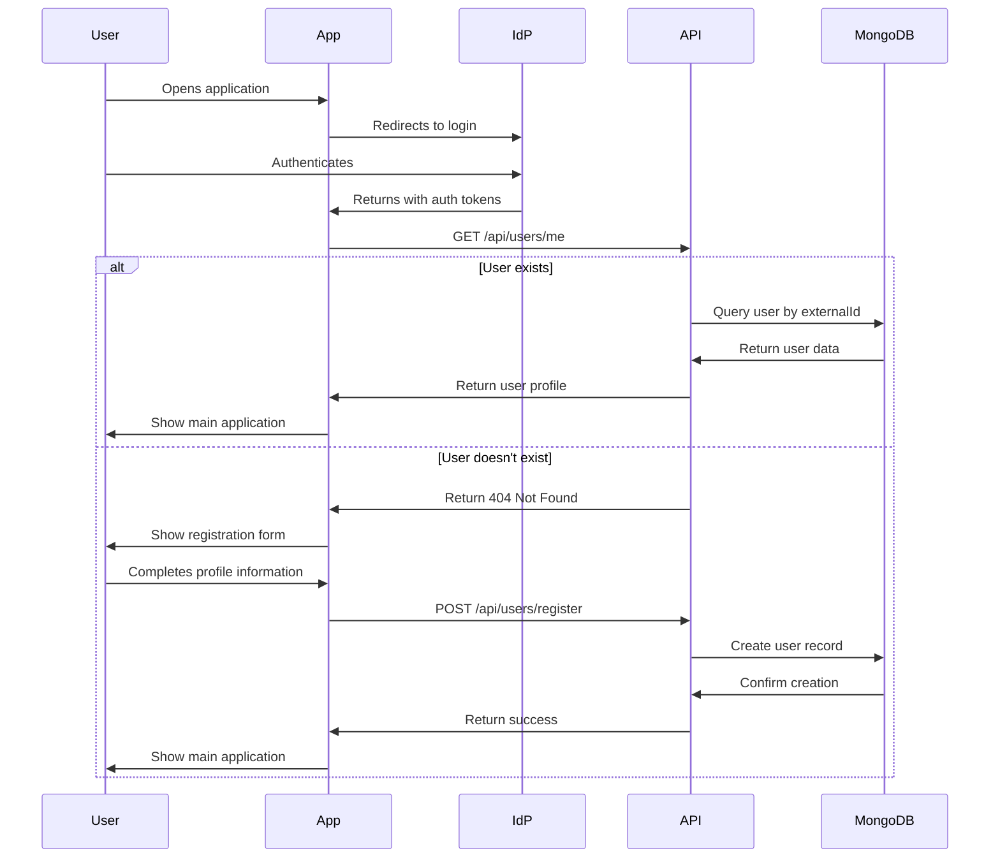
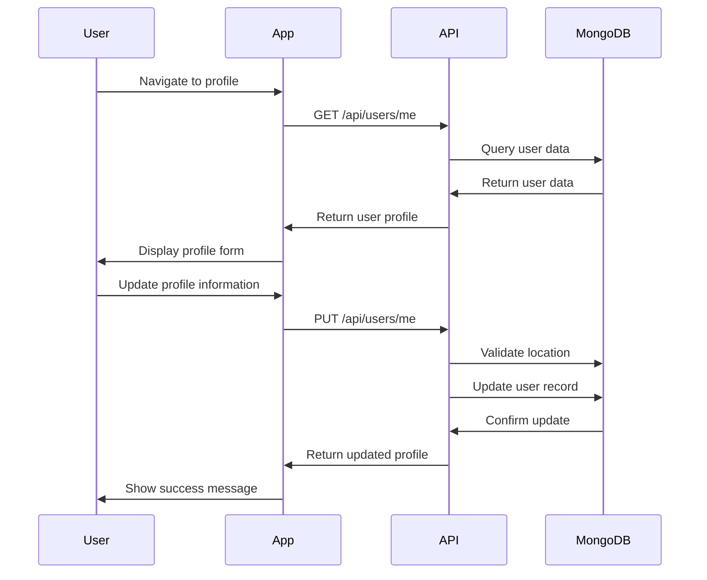

# User Management

## Overview

The Emergency Duress Application includes comprehensive user management functionality that allows users to register with the system, update their profiles, and manage their account information. This document details the user management features, implementation, and related API endpoints.

## User Experience

### Registration Flow

1. **Authentication**: Users first authenticate with the identity provider (IdP)
2. **Profile Setup**: After authentication, users complete their profile by providing:
   - Contact number
   - Location selection
   - Room number (optional)
3. **Confirmation**: The system confirms successful registration and redirects to the main application

### Profile Management

Users can update their profile information at any time:

- Contact number
- Location
- Room number

Note that core identity information (name, email) is managed by the identity provider and cannot be changed directly in the application.

## Technical Implementation

### Data Model

The user data model includes:

```csharp
public class User
{
    public string Id { get; set; }
    public string ExternalId { get; set; }
    public string Name { get; set; }
    public string Email { get; set; }
    public string? ContactNumber { get; set; }
    public string? LocationId { get; set; }
    public string? RoomNumber { get; set; }
    public DateTime CreatedAt { get; set; }
    public DateTime UpdatedAt { get; set; }
}
```

Key fields:

- `Id`: Internal MongoDB identifier
- `ExternalId`: Identity provider's user ID (from IdP)
- `LocationId`: Reference to the user's assigned location
- `RoomNumber`: User's room number at their location

### API Endpoints

#### User Registration

```
POST /api/users/register
```

Request body:

```json
{
  "locationId": "string",
  "roomNumber": "string (optional)",
  "contactNumber": "string"
}
```

This endpoint:

1. Extracts user identity information from the authentication token
2. Checks if the user already exists in the database
3. Creates or updates the user record with the provided information

#### Get User Profile

```
GET /api/users/me
```

Returns the current user's profile information, including:

- User details (name, email, contact number, room number)
- Location information (if a location is assigned)

Response body:

```json
{
  "id": "string",
  "externalId": "string",
  "name": "string",
  "email": "string",
  "contactNumber": "string",
  "roomNumber": "string",
  "locationId": "string",
  "createdAt": "2025-01-01T00:00:00Z",
  "updatedAt": "2025-01-01T00:00:00Z",
  "location": {
    "id": "string",
    "name": "string",
    "defaultPhoneNumber": "string",
    "defaultEmail": "string",
    "createdAt": "2025-01-01T00:00:00Z",
    "updatedAt": "2025-01-01T00:00:00Z"
  }
}
```

#### Update User Profile

```
PUT /api/users/me
```

Request body:

```json
{
  "locationId": "string",
  "roomNumber": "string (optional)",
  "contactNumber": "string"
}
```

This endpoint:

1. Validates the user's identity from the authentication token
2. Verifies the requested location exists
3. Updates the user's profile with the provided information

### Frontend Implementation

The frontend implements user management through:

1. **Registration Form**

   - Collects required user information
   - Validates input before submission
   - Handles API communication

2. **Profile Management**

   - Displays current user information
   - Allows editing of profile details
   - Validates and submits changes

3. **Data Fetching**
   - Uses TanStack Query for data fetching and caching
   - Implements offline support for profile data

### Registration Flow Sequence



### Profile Update Flow



## Security Considerations

### Authentication Requirements

All user management endpoints require authentication:

- Valid JWT token must be provided
- Token must contain user identity information (sub/externalId)

### Data Validation

The API implements thorough validation:

- Location ID is validated against existing locations
- Contact number format is validated
- Required fields are checked

### Privacy

User data is protected through:

- HTTPS for all API communication
- Authentication requirements for accessing user data
- Users can only access and modify their own profile

## Testing

The user management functionality includes:

1. **Unit Tests**

   - Controller tests for registration and profile endpoints
   - Validation logic tests

2. **Integration Tests**

   - End-to-end registration flow
   - Profile update scenarios

3. **Edge Cases**
   - Handling missing user data
   - Validation error scenarios
   - Authentication edge cases

## Acceptance Criteria

- ✅ Users can register with the system after authentication
- ✅ Users can view their profile information
- ✅ Users can update their profile details
- ✅ User data is properly validated
- ✅ User data is securely stored and accessed
- ✅ Profile information is available offline after initial load
