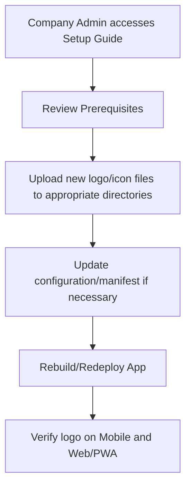

# Company Logo Setup Guide

## Overview

This guide provides instructions for the Company Administrator to update the default company logo/icon, ensuring that the company's branding is correctly reflected in both the mobile and web versions of the app.

## Prerequisites

- **Role:** Company Administrator privileges are required.
- **Logo Requirements:** Ensure that the logo file is in PNG or JPEG format and follows the recommended dimensions.
- **Access:** Ability to update files in the Expo project:
  - For mobile: Update assets in `apps/expo/assets/images` if applicable.
  - For web/PWA: Update the logo files in `apps/expo/public` and, if necessary, the configuration in `manifest.json` and service worker references in `service-worker.js`.

## Steps to Change the Logo/Icon

1. **Locate the Existing Logo Files:**

   - **Mobile Assets:** Check the `apps/expo/assets/images` directory.
   - **Web/PWA Assets:** Check the `apps/expo/public` directory. The current logo files include:
     - `logo192.png`
     - `logo512.png`
   - Review `apps/expo/public/manifest.json` to see how these logos are referenced.
   - Verify that `service-worker.js` uses the correct logo (e.g., `/logo192.png` for notifications).

2. **Upload the Company Logo/Icon:**

   - Prepare your new logo files (e.g., `company-logo.png`) in the required sizes.
   - For mobile app updates:
     - Replace or add the new logo file in `apps/expo/assets/images` as needed.
   - For web/PWA updates:
     - Replace `logo192.png` and `logo512.png` in `apps/expo/public` with your new files.
     - If necessary, update the `src` entries in `apps/expo/public/manifest.json` to reflect any changes in file names or paths.

3. **Update the Configuration (if applicable):**

   - Ensure that the configuration or manifest file correctly references the new logo files.
   - For example, in `apps/expo/public/manifest.json` verify the `"icons"` array. An updated example section might look like:
     ```json
     "icons": [
       {
         "src": "favicon.ico",
         "sizes": "64x64 32x32 24x24 16x16",
         "type": "image/x-icon"
       },
       {
         "src": "logo192.png",
         "type": "image/png",
         "sizes": "192x192"
       },
       {
         "src": "logo512.png",
         "type": "image/png",
         "sizes": "512x512"
       }
     ]
     ```
   - Confirm that `service-worker.js` uses the correct path for the icon and badge (e.g., `/logo192.png`).

4. **Deploy/Build:**
   - For mobile apps: Rebuild the application so that the new logo is bundled.
   - For web/PWA: Redeploy or refresh the application so that the manifest and service worker updates take effect.

## Rollout and Verification

- **Mobile App:**
  - After rebuilding, test that the new logo/icon appears within the app.
- **Web/PWA:**
  - Ensure that the updated logo is visible on the site.
  - Trigger a service worker update if necessary to reflect changes in notifications and icons.

## Troubleshooting

- **Logo Not Updating:** Confirm that the file paths in the configuration files (e.g., `manifest.json` and `service-worker.js`) accurately reference the new logo files.
- **File Format or Sizing Issues:** Verify that the new logo files adhere to the recommended formats and dimensions.

## Diagram



---

This guide ensures consistent branding across both mobile and web applications by detailing how to update the logo assets in the Expo project.
